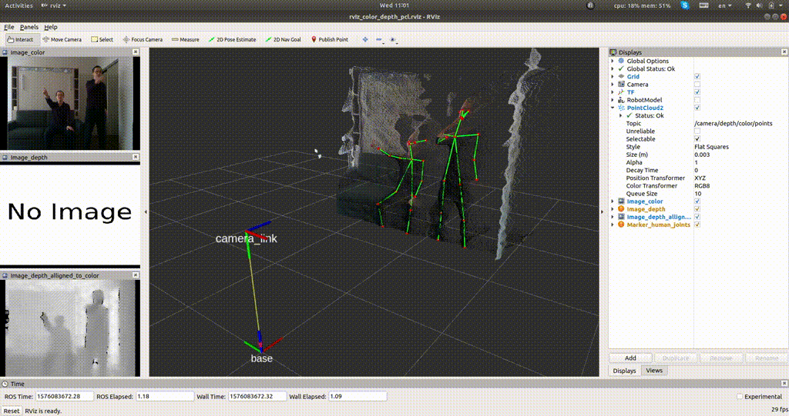
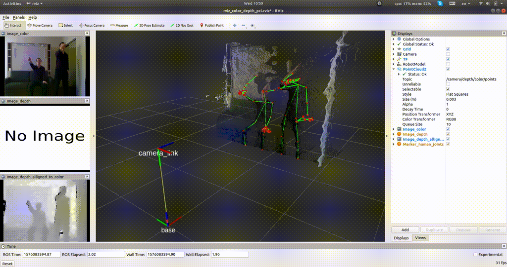

ros_openpose_rgbd
==================================
Combine Openpose 2D detection results and depth image to obtain human 3D joint positions, and draw in ROS rviz.

**Demo** (Body only; 12 fps; Kind of good.)


**Demo** (Body+hand; 3 fps; Inaccurate hands' 3D positions.)


- [ros_openpose_rgbd](#ros-openpose-rgbd)
- [1. Introduction](#1-introduction)
- [2. Installation](#2-installation)
- [3. Usage](#3-usage)
  * [3.1. Unittest](#31-unittest)
    + [3.1.1. lib_openpose_detector.py](#311-lib-openpose-detectorpy)
    + [3.1.2. lib_draw_3d_joints.py](#312-lib-draw-3d-jointspy)
  * [3.2. Test Data from Disk](#32-test-data-from-disk)
  * [3.3. Test Data from ROS Topic](#33-test-data-from-ros-topic)
  * [3.4. Test Data from Realsense](#34-test-data-from-realsense)
- [4.Results](#4results)
  * [4.1. Speed](#41-speed)
  * [4.2. Accuracy](#42-accuracy)
- [5. Bugs](#5-bugs)

<small><i><a href='http://ecotrust-canada.github.io/markdown-toc/'>Table of contents generated with markdown-toc</a></i></small>


# 1. Introduction

**Algorithm:** The workflow is:
1. Detect **2D human joints** from *color image* by Openpose.
2. Compute joints' **3D positions** by getting the depth from *depth image*. 
4. Visualize them in rviz by ROS markers.

**Code:** The main script is [detect_and_draw_joints.py](detect_and_draw_joints.py), which imports two library scripts [lib_openpose_detector.py](lib_openpose_detector.py) and [lib_draw_3d_joints.py](lib_draw_3d_joints.py).

**Data**: See [data/image_i1](data/image_i1) and [data/images_n40](data/images_n40).

**Joints' format:** I'm using `COCO` model for body detection. See this [page](https://github.com/CMU-Perceptual-Computing-Lab/openpose/blob/master/doc/output.md), and the picture of [body](doc/keypoints_pose_coco_18.png) and [hand](doc/keypoints_hand.png).  

**Example of usage**: Check the arguments by `rosrun ros_openpose_rgbd detect_and_draw_joints.py -h`. Read Section `3. Usage` for more details.

# 2. Installation

**Environment:**    
Ubuntu 18.04, ROS melodic, python2.

**Openpose**:
First, install [Openpose](https://github.com/CMU-Perceptual-Computing-Lab/openpose) by following its very detailed and very long official tutorial.  
Please also compile its code into Python2 libraries. Tutorial is [here](https://github.com/CMU-Perceptual-Computing-Lab/openpose/blob/master/doc/modules/python_module.md).

The major (not complete) steps are listed below:
``` 
cd ~/githubs
git clone https://github.com/CMU-Perceptual-Computing-Lab/openpose; cd openpose
mkdir -p build; cd build
cmake  -DBUILD_PYTHON=ON \
    -DPYTHON_EXECUTABLE=/usr/bin/python2.7 \
    -DPYTHON_LIBRARY=/usr/lib/x86_64-linux-gnu/libpython2.7m.so ..
make -j11
sudo make install # Install c++/python libraries to `/usr/local/python`.
```

After installation, check the environment variable `OPENPOSE_HOME`. We will need to read model from `${OPENPOSE_HOME}/models/`.
```
echo "'${OPENPOSE_HOME}' should be the folder of your openpose."
```

Make sure you can run its example 
```
cd ${OPENPOSE_HOME}/build/examples/tutorial_api_python
python 04_keypoints_from_images.py
```

Set the environment variable `OPENPOSE_PYTHONPATH` as the installation directory of openpose python libraries. It's probably `/usr/local/python`.
```
export OPENPOSE_PYTHONPATH="/usr/local/python"
```

# 3. Usage

## 3.1. Unittest

### 3.1.1. lib_openpose_detector.py
```
python lib_openpose_detector.py
```
This test case reads a color image from [data/image_i1/color/](data/image_i1/color/), detect the human joints, and then ouputs the results to [output/](output/).

### 3.1.2. lib_draw_3d_joints.py
```
python lib_draw_3d_joints.py
roslaunch ros_openpose_rgbd run_rviz.launch
```
This test case reads the 2D joints and image from [data/image_i1/](data/image_i1/), computes the 3D joint positions, and then draw the joints in rviz.

## 3.2. Test Data from Disk

```
DATA="data/images_n40/"
rosrun ros_openpose_rgbd detect_and_draw_joints.py \
    --data_source disk \
    --base_folder $(rospack find ros_openpose_rgbd) \
    --folder_color $DATA/color \
    --folder_depth $DATA/depth \
    --camera_info_file $DATA/cam_params_realsense.json \
    --detect_hand true # true or false
roslaunch ros_openpose_rgbd run_rviz.launch
```

## 3.3. Test Data from ROS Topic

Please download the color/depth images pulisher:
```
ROOT=$(rospack find ros_openpose_rgbd)
cd ${ROOT}/.. # cd to ~/catkin_ws/src/ folder.
if [ ! -d "ros_pub_and_sub_rgbd_and_cloud" ]; then
    repo="https://github.com/felixchenfy/ros_pub_and_sub_rgbd_and_cloud"
    git clone ${repo}
    cd ros_pub_and_sub_rgbd_and_cloud
    chmod a+x pub_rgbd_and_cloud.py
fi
```

OK. Now publish data, and start detection and drawing:

```
roslaunch ros_openpose_rgbd publish_test_rgbd_data.launch
rosrun ros_openpose_rgbd detect_and_draw_joints.py \
    --data_source rostopic \
    --ros_topic_color camera/color/image_raw \
    --ros_topic_depth camera/aligned_depth_to_color/image_raw \
    --ros_topic_camera_info camera/color/camera_info \
    --detect_hand true # true or false
```

The publish rate is set as 1 image/second. Please read [launch/publish_test_rgbd_data.launch](launch/publish_test_rgbd_data.launch), and change publish settings in [config/publish_test_rgbd_data_config.yaml](config/publish_test_rgbd_data_config.yaml).

## 3.4. Test Data from Realsense

In 3.3, the data is read from disk and published to ROS topics. Here we read it from Realsense D435.

```
roslaunch ros_openpose_rgbd run_realsense.launch
rosrun ros_openpose_rgbd detect_and_draw_joints.py \
    --data_source rostopic \
    --is_using_realsense true \
    --detect_hand false # My laptop is not fast enough to detect hand.
```

# 4.Results

## 4.1. Speed

Running speed of the main program `detect_and_draw_joints.py` is:
* Settings: RTX 2070; Image resize to 320x240.
* Results:
    * body + hand: 3 fps.
    * Only body: 12 fps.


## 4.2. Accuracy
See the two gif at the top of this README.
* The 3D body joints are not too bad, but still has some "trembling" even if I'm standing still. 
* The 3D hand joints are awful. 
    (1) One thing is that due to self-occlusion and motion blur, sometimes 2D joints are not detected or are not accurate. 
    (2) Another thing is that finger's depth is very inaccurate. We know that the depth near an object's edge is likely to be noisy, and this is especially severe for small and thing objects like fingers.

Besides the above problem, the Realsense also doesn't work well as expected. The measured depth value becomes inaccurate when the object is 1 meter away. I didn't do the experiment, but I feel it's about 1cm error at 1 meter, and up to 10cm when the object is several meters away (Let's say 4 meters). Also, the depth is fluctuating noticeably for distant objects, which can even be noticed from depth image.

# 5. Bugs
* The ROS marker `delete` function sometimes doesn't work. I can't solve it right now, maybe you need to close rviz and open it again in order to clear the ROS markers. The corresponding delete function is defined in [utils/lib_rviz_marker.py](utils/lib_rviz_marker.py) and `def delete_marker`. 
